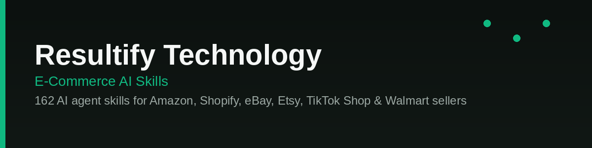

<div align="center">

# E-Commerce AI Skills by Resultify Technology

**162 free AI agent skills for Amazon, Shopify, eBay, Etsy, TikTok Shop & Walmart sellers.**

[](./LICENSE)

[](https://resultify.io)

Works with **Claude Code** · **Cursor** · **Windsurf** · **Codex** · any Skills-compatible AI agent

</div>

---

## Quick Start

Copy the skill folder(s) you need into your project's `.claude/skills/` directory (or wherever your agent reads skills from), or install straight from GitHub:

```bash
npx skills add resultify-technology/Ecommerce-AI-Skills -g
```

Or install a specific skill:

```bash
npx skills add resultify-technology/Ecommerce-AI-Skills --skill <skill-name> -g
```

Example — install the growth strategy skill:

```bash
npx skills add resultify-technology/Ecommerce-AI-Skills --skill ecommerce-growth-strategy -g
```


Then just ask your AI assistant naturally:

> *"I sell pet clothes on Shopify doing $8K/month. How do I get to $20K in 6 months?"*

---

## What Are E-Commerce Skills?

E-commerce skills are plain-text instruction files that give AI agents specialized expertise in selling online. No binaries, no API keys, no setup friction — just markdown that any LLM can read.

Install a skill, ask your AI assistant a question about your store, and get expert-level analysis — pricing strategy, listing optimization, market expansion, PPC campaigns — powered by proven e-commerce frameworks.

---

## ⭐ Most Popular

🏆 **[E-Commerce Growth Strategy](./ecommerce-growth-strategy)**
Diagnoses your business health using unit economics (CAC, LTV, AOV), identifies the #1 growth lever, and builds a 90-day roadmap.

📦 **[Cross-Border E-Commerce](./cross-border-ecommerce)**
Scores 15+ international markets, handles VAT/IOSS/GST compliance, plans logistics and localization strategy.

📣 **[Marketing Strategy Builder](./ecommerce-marketing-strategy-builder)**
Full-stack omnichannel marketing — paid ads, SEO, email/SMS, content, social media, and influencer partnerships.

💰 **[Amazon Profit Calculator](./profit-margin-calculator/profit-margin-calculator-amazon)**
Complete FBA fee breakdown — referral fees, fulfillment, storage costs, break-even analysis, pricing recommendations.

📢 **[PPC Strategy Planner](./ecommerce-ppc-strategy-planner)**
Cross-platform PPC strategy for Google, Meta & TikTok with ROAS targets and budget allocation.

📝 **[Product Description Generator](./product-description-generator)**
SEO-optimized product descriptions for any platform — Amazon, eBay, Walmart, Shopify, Etsy, TikTok Shop.

---

## Collection

**Status key:** ✅ Available (production-ready) · 🔶 Beta (functional, being improved)

### 🕵️ Competitor Analysis (6 skills)

| Skill | Description | Status |
|-------|-------------|--------|
| [amazon-review-checker](./review-checker/amazon-review-checker) | Amazon review authenticity — fake reviews, time clustering, verified purchase validation. | ✅ Available |
| [ebay-review-checker](./review-checker/ebay-review-checker) | eBay review authenticity — fake feedback, suspicious patterns, buyer manipulation. | ✅ Available |
| [walmart-review-checker](./review-checker/walmart-review-checker) | Walmart review authenticity — fake reviews, WFS verified badge analysis, red flags. | ✅ Available |
| [competitor-price-analysis](./competitor-price-analysis) | Competitor pricing strategy analysis — price mapping, gaps, elasticity signals. | ✅ Available |
| [ecommerce-competitor-analysis](./ecommerce-competitor-analysis) | Cross-platform competitor analysis — multi-channel presence, strategy, positioning. | ✅ Available |
| [product-review-analysis](./product-review-analysis) | Product review analysis — pain points, praise patterns, feature requests, sentiment. | ✅ Available |

### 💰 Pricing & Profitability (7 skills)

| Skill | Description | Status |
|-------|-------------|--------|
| [profit-margin-calculator-amazon](./profit-margin-calculator/profit-margin-calculator-amazon) | Amazon profit calculator — FBA fees, referral fees, break-even, pricing recommendations. | ✅ Available |
| [profit-margin-calculator-shopify](./profit-margin-calculator/profit-margin-calculator-shopify) | Shopify/DTC profit calculator — ad spend, CAC, payment processing, 3PL, LTV/CAC analysis. | ✅ Available |
| [profit-margin-calculator-tiktok](./profit-margin-calculator/profit-margin-calculator-tiktok) | TikTok Shop profit calculator — affiliate commissions, platform fees, FBT, return rates. | ✅ Available |
| [profit-margin-calculator-walmart](./profit-margin-calculator/profit-margin-calculator-walmart) | Walmart profit calculator — WFS fulfillment, storage fees, referral fees, comparison. | ✅ Available |
| [competitive-pricing-strategy](./competitive-pricing-strategy) | Price architecture and competitor positioning — normalized offer maps, contribution floors, response rules, and channel rollout. | ✅ Available |
| [dynamic-pricing-ecommerce](./dynamic-pricing-ecommerce) | Guardrailed repricing systems — signals, floors and ceilings, rule matrices, simulations, approvals, and rollback. | ✅ Available |
| [price-optimization-tool](./price-optimization-tool) | Evidence-bounded price decisions — unit economics, elasticity, candidate scenarios, experiment design, and rollout gates. | ✅ Available |

### 🚀 Growth & Expansion (16 skills)

| Skill | Description | Status |
|-------|-------------|--------|
| [ecommerce-growth-strategy](./ecommerce-growth-strategy) | Strategic growth advisor — unit economics, Ansoff Matrix, 5 growth levers, 90-day roadmap. | ✅ Available |
| [cross-border-ecommerce](./cross-border-ecommerce) | Cross-border expansion — market scoring, logistics comparison, VAT/IOSS/GST compliance, payment localization, cultural adaptation. | ✅ Available |
| [brand-protection-amazon](./brand-protection/brand-protection-amazon) | Amazon brand protection — hijackers, counterfeits, MAP violations, Brand Registry. | ✅ Available |
| [brand-protection-ebay](./brand-protection/brand-protection-ebay) | eBay brand protection — unauthorized sellers, counterfeits, VeRO complaints. | ✅ Available |
| [brand-protection-shopify](./brand-protection/brand-protection-shopify) | Shopify/DTC brand protection — counterfeit stores, DMCA takedowns, domain monitoring. | ✅ Available |
| [brand-protection-tiktok](./brand-protection/brand-protection-tiktok) | TikTok Shop brand protection — counterfeit detection, IP reporting, seller violations. | ✅ Available |
| [brand-protection-walmart](./brand-protection/brand-protection-walmart) | Walmart brand protection — unauthorized sellers, MAP violations, IP infringement. | ✅ Available |
| [product-differentiation-amazon](./product-differentiation/product-differentiation-amazon) | Amazon differentiation — competitor weaknesses, negative review pain points, USP generation. | ✅ Available |
| [product-differentiation-ebay](./product-differentiation/product-differentiation-ebay) | eBay differentiation — competitor analysis, listing gaps, unique selling points. | ✅ Available |
| [product-differentiation-shopify](./product-differentiation/product-differentiation-shopify) | Shopify/DTC differentiation — competitor weaknesses, market positioning, brand strategy. | ✅ Available |
| [product-differentiation-tiktok](./product-differentiation/product-differentiation-tiktok) | TikTok Shop differentiation — viral product analysis, trend gaps, content angles. | ✅ Available |
| [tiktok-shop-cross-border](./tiktok-shop-cross-border) | Cross-border selling on TikTok Shop — market selection, logistics, localization, compliance. | ✅ Available |
| [ecommerce-personalization](./ecommerce-personalization) | Personalization — recommendations, dynamic content, customer segmentation. | 🔶 Beta |
| [ecommerce-business-plan](./ecommerce-business-plan) | E-commerce business plan — market analysis, financial projections, milestone roadmap. | 🔶 Beta |
| [omnichannel-ecommerce](./omnichannel-ecommerce) | Omnichannel strategy — channel selection, inventory sync, unified branding. | 🔶 Beta |
| [multichannel-ecommerce](./multichannel-ecommerce) | Multichannel management — inventory sync, order routing, listing syndication. | 🔶 Beta |

### 📣 E-Commerce Marketing (16 skills)

| Skill | Description | Status |
|-------|-------------|--------|
| [ecommerce-marketing-strategy-builder](./ecommerce-marketing-strategy-builder) | Full-stack omnichannel marketing — paid ads, SEO, email/SMS, content, social, influencers. | ✅ Available |
| [ecommerce-email-marketing-builder](./ecommerce-email-marketing-builder) | Email marketing campaign builder — flows, sequences, templates, automation strategies. | ✅ Available |
| [ecommerce-content-marketing](./ecommerce-content-marketing) | Content marketing strategy — customer reviews, trends, competitor analysis, content calendars. | ✅ Available |
| [tiktok-influencer-marketing](./tiktok-influencer-marketing) | TikTok creator campaigns — discovery, outreach, ROI tracking, UGC strategy. | ✅ Available |
| [tiktok-creator-marketplace](./tiktok-creator-marketplace) | Creator Marketplace strategy — finding creators, negotiation, campaign management, performance metrics. | ✅ Available |
| [tiktok-shop-content-strategy](./tiktok-shop-content-strategy) | Content creation for TikTok Shop — trending formats, hooks, product showcasing, hashtag strategy. | ✅ Available |
| [tiktok-shop-branding](./tiktok-shop-branding) | Brand building on TikTok — brand identity, content pillars, community engagement, brand storytelling. | ✅ Available |
| [ecommerce-social-media-marketing](./ecommerce-social-media-marketing) | Social media marketing — content calendars, platform strategy, social commerce. | ✅ Available |
| [shopify-marketing](./shopify-marketing) | Shopify marketing — SEO, email, paid ads, CRO, retention for DTC brands. | ✅ Available |
| [product-launch-strategy](./product-launch-strategy) | Product launch playbook — pre-launch, launch day, post-launch for Amazon and Shopify. | 🔶 Beta |
| [ecommerce-branding](./ecommerce-branding) | E-commerce branding — positioning, messaging, visual identity, brand consistency. | 🔶 Beta |
| [tiktok-live-selling](./tiktok-live-selling) | TikTok Live selling strategy — show planning, engagement tactics, conversion optimization, audience building. | 🔶 Beta |
| [influencer-outreach](./influencer-outreach) | Influencer outreach — discovery, templates, negotiation, contracts, relationship management. | 🔶 Beta |
| [affiliate-marketing-strategy](./affiliate-marketing-strategy) | Affiliate program — setup, commission design, recruitment, tracking, scaling. | 🔶 Beta |
| [ecommerce-video-marketing](./ecommerce-video-marketing) | Video marketing — product demos, UGC, short-form, Amazon video, video SEO. | 🔶 Beta |
| [shoppable-video](./shoppable-video) | Shoppable video — TikTok, Reels, Shorts, product tagging, live shopping. | 🔶 Beta |

### 📝 Listing Optimization (8 skills)

| Skill | Description | Status |
|-------|-------------|--------|
| [product-description-generator](./product-description-generator) | Product descriptions for any platform — Amazon, eBay, Walmart, Shopify, Etsy, TikTok Shop. | ✅ Available |
| [etsy-seo](./etsy-seo) | Etsy SEO analyzer — title optimization, tag analysis, description scoring, SEO scoring. | ✅ Available |
| [product-title-optimization](./product-title-optimization) | Product title optimization — platform-specific rules, keyword placement, CTR improvement. | 🔶 Beta |
| [walmart-listing-optimization](./walmart-listing-optimization) | Walmart listing optimization — Content Quality Score, search, rich media, attributes. | 🔶 Beta |
| [product-page-seo](./product-page-seo) | Product page SEO — structured data, page speed, mobile optimization, content enrichment. | 🔶 Beta |
| [ebay-seo](./ebay-seo) | eBay Cassini SEO — titles, item specifics, category selection, seller performance. | 🔶 Beta |
| [shopify-seo](./shopify-seo) | Shopify SEO — technical audit, product/collection pages, blog, schema, internal linking. | 🔶 Beta |
| [woocommerce-seo](./woocommerce-seo) | WooCommerce SEO — technical audit, product pages, schema markup, site speed, content. | 🔶 Beta |

### 📢 Advertising (4 skills)

| Skill | Description | Status |
|-------|-------------|--------|
| [ecommerce-ppc-strategy-planner](./ecommerce-ppc-strategy-planner) | Cross-platform PPC strategy — Google, Meta, TikTok ads. ROAS targets, budget allocation. | ✅ Available |
| [google-shopping-optimization](./google-shopping-optimization) | Google Shopping — feed optimization, bidding, Performance Max, ROAS optimization. | 🔶 Beta |
| [ebay-advertising](./ebay-advertising) | eBay Promoted Listings — Standard, Advanced, Offsite Ads, bidding, ROAS optimization. | 🔶 Beta |
| [walmart-advertising-strategy](./walmart-advertising-strategy) | Walmart Connect — Sponsored Products/Brands, bidding, budget allocation, ROAS. | 🔶 Beta |

### 📡 Monitoring & Alerts (5 skills)

| Skill | Description | Status |
|-------|-------------|--------|
| [brand-monitoring](./brand-monitoring) | Brand mention tracking across Reddit, Google News, YouTube, DuckDuckGo. Sentiment analysis, crisis detection. | ✅ Available |
| [review-monitoring](./review-monitoring) | Review monitoring — negative review alerts, competitor tracking, response workflows. | 🔶 Beta |
| [sales-tracking-tool](./sales-tracking-tool) | Sales performance tracking — KPI dashboards, trend analysis, anomaly detection. | 🔶 Beta |
| [competitor-price-tracker](./competitor-price-tracker) | Competitor price monitoring — change alerts, promotion detection, price war response. | 🔶 Beta |
| [social-media-monitor](./social-media-monitor) | Social media monitoring — mentions, sentiment, competitor activity across platforms. | 🔶 Beta |

### 📦 Supply Chain & Logistics (6 skills)

| Skill | Description | Status |
|-------|-------------|--------|
| [supply-chain-optimization-amazon](./supply-chain-optimization/supply-chain-optimization-amazon) | Amazon supply chain — FBA inventory, IPI score, storage fees, restock optimization. | ✅ Available |
| [supply-chain-optimization-shopify](./supply-chain-optimization/supply-chain-optimization-shopify) | Shopify/DTC supply chain — cash flow, inventory, shipping costs, 3PL optimization. | ✅ Available |
| [supply-chain-optimization-tiktok](./supply-chain-optimization/supply-chain-optimization-tiktok) | TikTok Shop supply chain — affiliate payouts, return rates, viral product lifecycle. | ✅ Available |
| [supply-chain-optimization-walmart](./supply-chain-optimization/supply-chain-optimization-walmart) | Walmart supply chain — WFS costs, referral fees, Walmart Connect ads, comparison. | ✅ Available |
| [ecommerce-returns-management](./ecommerce-returns-management) | Returns management — rate reduction, reverse logistics, root cause analysis. | 🔶 Beta |
| [ecommerce-shipping-rates](./ecommerce-shipping-rates) | Shipping rate comparison — UPS, FedEx, USPS, DHL, zone optimization. | 🔶 Beta |

### ⚙️ Operations & Analytics (15 skills)

| Skill | Description | Status |
|-------|-------------|--------|
| [warehouse-optimization](./warehouse-optimization) | Warehouse & inventory optimization — safety stock, reorder points, ABC analysis, IPI score. | ✅ Available |
| [tiktok-shop-analytics](./tiktok-shop-analytics) | TikTok Shop analytics — video, live, affiliate, ads performance, benchmarks. | ✅ Available |
| [ecommerce-landing-page](./ecommerce-landing-page) | Landing page audit — CTA, trust signals, copy optimization, A/B testing. | 🔶 Beta |
| [ecommerce-checkout-optimization](./ecommerce-checkout-optimization) | Checkout optimization — cart abandonment reduction, payment methods, friction analysis. | 🔶 Beta |
| [shopify-analytics-guide](./shopify-analytics-guide) | Shopify analytics — dashboard metrics, cohort analysis, LTV, custom reports. | 🔶 Beta |
| [tiktok-shop-conversion](./tiktok-shop-conversion) | Conversion optimization — product detail pages, video hooks, urgency tactics, checkout flow. | 🔶 Beta |
| [tiktok-shop-creator-management](./tiktok-shop-creator-management) | Creator relationship management — recruitment, briefing, content approval, commission optimization. | 🔶 Beta |
| [tiktok-shop-customer-service](./tiktok-shop-customer-service) | Customer service on TikTok Shop — response time, dispute resolution, auto-replies, buyer satisfaction. | 🔶 Beta |
| [tiktok-shop-inventory](./tiktok-shop-inventory) | Inventory management for TikTok Shop — demand forecasting, viral stock planning, FBT optimization. | 🔶 Beta |
| [conversion-rate-optimization](./conversion-rate-optimization) | CRO — funnel analysis, heuristic evaluation, user behavior, testing roadmap. | 🔶 Beta |
| [shopify-conversion-optimization](./shopify-conversion-optimization) | Shopify CRO — product pages, checkout, trust signals, mobile UX, page speed. | 🔶 Beta |
| [ecommerce-ab-testing](./ecommerce-ab-testing) | E-commerce A/B testing — Amazon Experiments, Shopify, ads, email, methodology. | 🔶 Beta |
| [shopify-ab-testing](./shopify-ab-testing) | Shopify A/B testing — hypothesis, product page tests, statistical significance. | 🔶 Beta |
| [ecommerce-customer-retention](./ecommerce-customer-retention) | Customer retention — email flows, loyalty, RFM segmentation, win-back, LTV. | 🔶 Beta |
| [ecommerce-subscription-model](./ecommerce-subscription-model) | Subscription models — replenishment, curation, pricing tiers, churn reduction. | 🔶 Beta |

### 🔍 Product Research (6 skills)

| Skill | Description | Status |
|-------|-------------|--------|
| [ecommerce-keyword-research](./ecommerce-keyword-research) | Cross-platform keyword research — Amazon, Shopify, Etsy, Google Shopping, TikTok Shop, Walmart. | 🔶 Beta |
| [dropshipping-product-research](./dropshipping-product-research) | Dropshipping product research — supplier reliability, margin analysis, marketing viability. | 🔶 Beta |
| [market-gap-analysis](./market-gap-analysis) | Identify underserved market gaps — competitor blind spots, review pain points, search demand gaps. | 🔶 Beta |
| [ebay-product-research](./ebay-product-research) | eBay product research — sell-through rates, ASP, competition, seasonal demand. | 🔶 Beta |
| [tiktok-shop-product-research](./tiktok-shop-product-research) | Product research for TikTok Shop — viral potential scoring, creator demand, category analysis. | 🔶 Beta |
| [tiktok-shop-trending-products](./tiktok-shop-trending-products) | Trending product discovery — viral product analysis, category trends, seasonal opportunities on TikTok. | 🔶 Beta |

### 🏪 Platform Guides & Tools (36 skills)

| Skill | Description | Status |
|-------|-------------|--------|
| [tiktok-shop-seller-guide](./tiktok-shop-seller-guide) | TikTok Shop guide — listing, content strategy, live selling, creator affiliates. | ✅ Available |
| [tiktok-shop-listing-optimization](./tiktok-shop-listing-optimization) | Product listing optimization — titles, descriptions, images, video, attributes for TikTok search. | ✅ Available |
| [tiktok-shop-affiliate-program](./tiktok-shop-affiliate-program) | Affiliate collaboration — commission structure, creator selection, sample management, performance tracking. | ✅ Available |
| [tiktok-shop-ads](./tiktok-shop-ads) | TikTok Shop advertising — Product Shopping Ads, Video Shopping Ads, Live Shopping Ads, bidding strategy. | ✅ Available |
| [etsy-seller-guide](./etsy-seller-guide) | Complete Etsy selling guide — shop setup, SEO, pricing, Star Seller, advertising. | 🔶 Beta |
| [ebay-seller-guide](./ebay-seller-guide) | Complete eBay guide — auction/BIN, Cassini SEO, Top Rated Seller, shipping. | 🔶 Beta |
| [walmart-seller-guide](./walmart-seller-guide) | Walmart Marketplace guide — application, listing, WFS, Connect ads, Pro Seller. | 🔶 Beta |
| [shopify-store-setup](./shopify-store-setup) | Shopify setup — plan selection, theme, products, payments, shipping, launch. | 🔶 Beta |
| [shopify-theme-optimization](./shopify-theme-optimization) | Theme speed and UX optimization — Core Web Vitals, Liquid code, image loading, mobile responsiveness. | 🔶 Beta |
| [shopify-app-recommendations](./shopify-app-recommendations) | App stack advisor — essential apps by business stage, cost optimization, performance impact analysis. | 🔶 Beta |
| [shopify-dropshipping](./shopify-dropshipping) | Dropshipping setup and scaling — supplier integration, automation, pricing strategy, customer experience. | 🔶 Beta |
| [shopify-email-flows](./shopify-email-flows) | Email automation flows — welcome series, abandoned cart, post-purchase, win-back, browse abandonment. | 🔶 Beta |
| [shopify-upsell-cross-sell](./shopify-upsell-cross-sell) | Upsell and cross-sell strategy — product recommendations, cart upsells, post-purchase offers, bundles. | 🔶 Beta |
| [shopify-checkout-customization](./shopify-checkout-customization) | Checkout optimization — Checkout Extensibility, custom fields, express payments, trust elements. | 🔶 Beta |
| [shopify-inventory-management](./shopify-inventory-management) | Multi-location inventory — transfers, low stock alerts, demand forecasting, safety stock, ABC analysis. | 🔶 Beta |
| [shopify-subscription-setup](./shopify-subscription-setup) | Subscription program setup — recurring billing, frequency options, churn reduction, lifetime value. | 🔶 Beta |
| [shopify-wholesale-channel](./shopify-wholesale-channel) | B2B/wholesale setup — wholesale pricing, minimum orders, custom catalogs, net payment terms. | 🔶 Beta |
| [shopify-international](./shopify-international) | Shopify Markets — multi-currency, translation, duties/taxes, localized pricing, market-specific content. | 🔶 Beta |
| [shopify-migration](./shopify-migration) | Platform migration to Shopify — from WooCommerce, Magento, BigCommerce, data transfer, URL redirects. | 🔶 Beta |
| [shopify-blog-strategy](./shopify-blog-strategy) | Content marketing via Shopify blog — SEO content, product education, buying guides, internal linking. | 🔶 Beta |
| [shopify-loyalty-program](./shopify-loyalty-program) | Customer loyalty and rewards — points systems, VIP tiers, referral programs, app selection. | 🔶 Beta |
| [shopify-product-photography-guide](./shopify-product-photography-guide) | DIY product photography — setup, lighting, backgrounds, editing, lifestyle shots, 360 views. | 🔶 Beta |
| [shopify-cart-abandonment](./shopify-cart-abandonment) | Cart abandonment recovery — email sequences, SMS, retargeting, exit intent, checkout friction audit. | 🔶 Beta |
| [shopify-facebook-instagram-shop](./shopify-facebook-instagram-shop) | Social selling setup — Facebook Shop, Instagram Shopping, product tagging, social checkout. | 🔶 Beta |
| [shopify-google-channel](./shopify-google-channel) | Google integration — Shopping feed, Performance Max, free listings, Merchant Center optimization. | 🔶 Beta |
| [shopify-landing-page-builder](./shopify-landing-page-builder) | High-converting landing pages — campaign pages, collection pages, seasonal promos, A/B testing. | 🔶 Beta |
| [shopify-tax-compliance](./shopify-tax-compliance) | Tax setup and compliance — sales tax, VAT, duty collection, tax-exempt customers, reporting. | 🔶 Beta |
| [shopify-speed-optimization](./shopify-speed-optimization) | Store speed audit — lazy loading, image compression, app bloat removal, theme code optimization. | 🔶 Beta |
| [tiktok-shop-pricing](./tiktok-shop-pricing) | Pricing strategy for TikTok — competitive pricing, commission impact, bundling, discount psychology. | 🔶 Beta |
| [tiktok-shop-promotions](./tiktok-shop-promotions) | TikTok Shop deals — Flash Deals, vouchers, free shipping, bundle deals, promotion planning. | 🔶 Beta |
| [tiktok-shop-fulfillment](./tiktok-shop-fulfillment) | Fulfillment setup — Fulfilled by TikTok, self-fulfillment, shipping templates, return policies. | 🔶 Beta |
| [tiktok-shop-shipping](./tiktok-shop-shipping) | TikTok Shop shipping setup — carrier selection, shipping templates, delivery expectations. | 🔶 Beta |
| [tiktok-shop-returns](./tiktok-shop-returns) | Return policy and process — TikTok Shop policies, return rate reduction, customer communication. | 🔶 Beta |
| [tiktok-shop-reviews](./tiktok-shop-reviews) | Review strategy for TikTok Shop — encouraging reviews, responding, leveraging UGC, social proof. | 🔶 Beta |
| [tiktok-shop-compliance](./tiktok-shop-compliance) | TikTok Shop policies and compliance — restricted products, intellectual property, content guidelines. | 🔶 Beta |
| [ebay-seller-tools](./ebay-seller-tools) | Essential tools and software for eBay sellers — listing, repricing, analytics, inventory, shipping, research. | 🔶 Beta |
| [walmart-seller-tools](./walmart-seller-tools) | Essential tools for Walmart Marketplace sellers — research, listing, ads, inventory, analytics. | 🔶 Beta |

### 🏬 Etsy Seller Tools (20 skills)

| Skill | Description | Status |
|-------|-------------|--------|
| [etsy-advertising](./etsy-advertising) | Etsy Ads strategy — budget allocation, bid management, promoted listings, offsite ads opt-out analysis. | ✅ Available |
| [etsy-competitor-analysis](./etsy-competitor-analysis) | Competitor research — pricing comparison, bestseller analysis, differentiation strategy. | ✅ Available |
| [etsy-custom-orders](./etsy-custom-orders) | Custom order management — communication templates, pricing, delivery timelines, return policies. | ✅ Available |
| [etsy-digital-products](./etsy-digital-products) | Digital product creation and selling — templates, printables, planners, digital art, delivery setup. | ✅ Available |
| [etsy-keyword-research](./etsy-keyword-research) | Etsy search optimization — long-tail keywords, tag research, competitor analysis, seasonal trends. | ✅ Available |
| [etsy-listing-photography](./etsy-listing-photography) | Product photography for Etsy — composition, lighting, backgrounds, editing, lifestyle shots, 360 views. | ✅ Available |
| [etsy-multi-shop](./etsy-multi-shop) | Multi-shop management — category separation, brand differentiation, efficiency optimization. | ✅ Available |
| [etsy-offsite-ads](./etsy-offsite-ads) | Offsite Ads analysis — when to opt out, ROI tracking, fee impact on margins, attribution. | ✅ Available |
| [etsy-pricing-strategy](./etsy-pricing-strategy) | Etsy pricing — cost calculation, competitor pricing, perceived value, shipping cost integration, sales and coupons. | ✅ Available |
| [etsy-print-on-demand](./etsy-print-on-demand) | POD integration — Printful, Printify, mockups, niche selection, margin optimization. | ✅ Available |
| [etsy-product-description](./etsy-product-description) | Product description writing — keyword integration, benefit-focused copy, FAQ, formatting. | ✅ Available |
| [etsy-review-strategy](./etsy-review-strategy) | Etsy review generation — thank you cards, follow-up messages, photo review incentives. | ✅ Available |
| [etsy-seasonal-strategy](./etsy-seasonal-strategy) | Seasonal selling calendar — holiday prep, trending categories, listing refresh timing, inventory planning. | ✅ Available |
| [etsy-seo-tags](./etsy-seo-tags) | Etsy tag optimization — 13-tag strategy, attribute optimization, search ranking factors. | ✅ Available |
| [etsy-shipping-strategy](./etsy-shipping-strategy) | Shipping strategy — free shipping vs markup, shipping profiles, international shipping, tracking. | ✅ Available |
| [etsy-shop-analytics](./etsy-shop-analytics) | Shop analytics — traffic sources, conversion rates, search terms, top listings performance. | ✅ Available |
| [etsy-shop-branding](./etsy-shop-branding) | Shop branding — banner design, logo, brand story, cohesive listing photography, packaging. | ✅ Available |
| [etsy-shop-setup](./etsy-shop-setup) | Etsy shop launch guide — policies, branding, first listings, SEO foundation, payment setup. | ✅ Available |
| [etsy-social-media-marketing](./etsy-social-media-marketing) | Social media marketing for Etsy — Pinterest, Instagram, TikTok strategies to drive shop traffic. | ✅ Available |
| [etsy-star-seller](./etsy-star-seller) | Star Seller achievement guide — response time, shipping tracking, 5-star ratings, maintaining status. | ✅ Available |

### 🛡️ Reliability & Site Performance (8 skills)

| Skill | Description | Status |
|-------|-------------|--------|
| [api-monitoring](./api-monitoring) | AI-powered API and webhook monitoring skill for e-commerce integrations. | ✅ Available |
| [domain-monitoring](./domain-monitoring) | AI-powered domain and SSL certificate monitoring skill. | ✅ Available |
| [file-integrity-monitoring](./file-integrity-monitoring) | AI-powered file integrity monitoring skill for e-commerce websites. | ✅ Available |
| [localization-testing](./localization-testing) | AI-powered localization and internationalization testing skill for e-commerce sites. | ✅ Available |
| [public-status-page](./public-status-page) | AI-powered public status page design skill for e-commerce businesses. | ✅ Available |
| [synthetic-monitoring](./synthetic-monitoring) | AI-powered synthetic monitoring skill for e-commerce websites. | ✅ Available |
| [visual-regression-testing](./visual-regression-testing) | AI-powered visual regression testing skill for e-commerce websites. | ✅ Available |
| [shopify-page-speed](./shopify-page-speed) | AI-powered Shopify page speed optimization skill. | ✅ Available |

### 🧰 Additional Tools (8 skills)

| Skill | Description | Status |
|-------|-------------|--------|
| [customer-feedback-analysis](./customer-feedback-analysis) | AI-powered customer feedback and review sentiment analysis skill. | ✅ Available |
| [ecommerce-feed-management](./ecommerce-feed-management) | AI-powered product feed management and monitoring skill. | ✅ Available |
| [inventory-tracking-software](./inventory-tracking-software) | AI-powered inventory tracking and monitoring skill for e-commerce businesses. | ✅ Available |
| [minimum-advertised-price](./minimum-advertised-price) | AI-powered MAP (Minimum Advertised Price) policy and enforcement skill. | ✅ Available |
| [online-reputation-management](./online-reputation-management) | AI-powered online reputation management skill for e-commerce brands. | ✅ Available |
| [restock-alert](./restock-alert) | AI-powered restock alert and replenishment planning skill. | ✅ Available |
| [share-of-shelf](./share-of-shelf) | AI-powered digital share of shelf analysis skill. | ✅ Available |
| [walmart-price-tracker](./walmart-price-tracker) | AI-powered Walmart price tracking and competitive pricing skill. | ✅ Available |

---

## Why Free?

These skills use publicly available data and proven frameworks — no API key, no paid subscription, no setup friction. Install and go.

They give your AI agent strong e-commerce *strategy* — pricing logic, listing structure, growth frameworks, compliance checklists. What they can't do on their own is reach into your live store, your ad accounts, or real-time marketplace data.

That's where **[Resultify Technology](https://resultify.io)** comes in. We build the automation layer on top: live dashboards, CRM and ad-account integrations, repricing systems, and managed execution — so the frameworks in this pack turn into running systems instead of one-off analysis. If a skill's output is something you'd rather have built, integrated, and monitored for you, that's the conversation to have with us.

---

## Related

- **[Resultify Technology](https://resultify.io)** — AI automation and growth systems for e-commerce sellers: custom dashboards, ad/CRM integrations, repricing and inventory automation, and managed execution built on top of these frameworks.

---

## License

MIT — see [LICENSE](./LICENSE). This pack is a Resultify Technology fork of the open-source `eCommerce-Skills` project; see [NOTICE.md](./NOTICE.md) for attribution and what changed.

---

<div align="center">

Curated and maintained by **[Resultify Technology](https://resultify.io)** — AI automation & growth systems for e-commerce sellers.

⭐ Fork it, brand it, ship it to your own clients.

</div>
